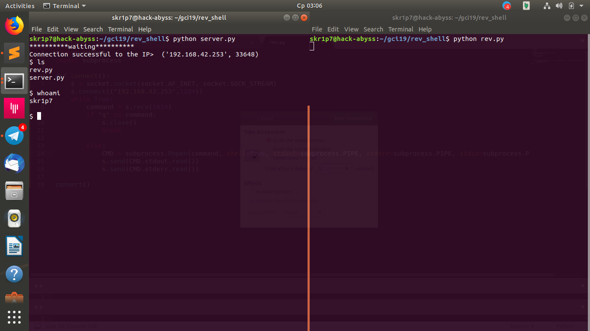

## A simple reverse shell for command execution written in Python

### Usage

Clone the repository by typing the following command:

```bash
$ git clone https://github.com/skr1p7/rev_shell.git
```
Navigate to the directory using the following command:

```bash
$ cd rev_shell
```

To start the listener, use:

```bash
$ python server.py 
```

For the victim machine, run the ***rev.py*** file using:

```bash
$ python rev.py
``` 

Example screenshot:



